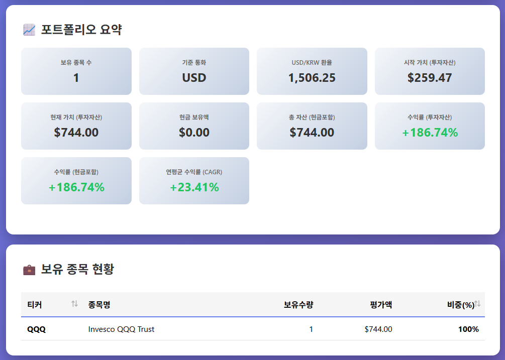

# Stock Back Testing Analyzer

주식 포트폴리오를 CSV로 업로드하고, 과거 가격 데이터를 기반으로 성과를 비교·분석하는 웹 애플리케이션입니다.



## 이 프로젝트로 할 수 있는 일

- 보유 주식 목록을 CSV로 업로드해 포트폴리오 성과를 분석합니다.
- S&P 500 ETF, Nasdaq ETF, 주요 지수 또는 샘플 헤지펀드 포트폴리오와 성과를 비교합니다.
- 수익률뿐 아니라 변동성, 샤프 비율, 소티노 비율, 알파, 베타 같은 위험 조정 지표를 확인합니다.
- USD/KRW 환율을 반영해 달러 또는 원화 기준으로 포트폴리오를 볼 수 있습니다.
- 로그인 후 분석한 포트폴리오를 저장하고 나중에 다시 확인할 수 있습니다.
- OpenAI API 키를 설정하면 포트폴리오 결과에 대한 AI 해설 기능을 사용할 수 있습니다.

> 분석 결과는 투자 의사결정을 돕기 위한 참고 자료이며, 투자 수익을 보장하지 않습니다.

## 누구에게 유용한가요?

- 내 포트폴리오가 시장 지수보다 좋은 성과를 냈는지 확인하고 싶은 개인 투자자
- 여러 종목을 보유하고 있으며 전체 포트폴리오 관점의 리스크를 보고 싶은 사용자
- 한국 주식과 미국 주식을 함께 보유하고 있어 통화 기준을 바꿔 보고 싶은 사용자
- CSV 기반으로 간단한 백테스트 웹 서비스를 개발하거나 확장하려는 개발자

## 빠른 시작

### 1. 저장소 준비

```bash
git clone <repository-url>
cd Stock-Back-Testing-Analyzer
```

### 2. Python 환경 준비

```bash
python -m venv .venv
source .venv/bin/activate
pip install -r requirements.txt
```

Windows PowerShell을 사용하는 경우 가상환경 활성화 명령은 다음과 같습니다.

```powershell
.\.venv\Scripts\Activate.ps1
```

### 3. 환경 변수 설정

프로젝트 루트에 `.env` 파일을 만들고 필요한 값을 설정합니다.

```env
SECRET_KEY=change-this-to-a-random-secret
OPENAI_API_KEY=your-openai-api-key
SMTP_SERVER=smtp.gmail.com
SMTP_PORT=587
SENDER_EMAIL=your-email@gmail.com
SENDER_PASSWORD=your-app-password
DEBUG=False
```

- `SECRET_KEY`는 세션과 비밀번호 해시에 사용되므로 반드시 안전한 값으로 바꾸세요.
- AI 분석이 필요 없다면 `OPENAI_API_KEY`는 비워 둘 수 있습니다.
- 이메일 설정이 없어도 개발 모드에서는 인증번호 확인을 콘솔 출력으로 대체할 수 있습니다.

### 4. 데이터베이스 초기화

```bash
python -c "from app import init_database; init_database()"
```

### 5. 애플리케이션 실행

```bash
python app.py
```

브라우저에서 다음 주소로 접속합니다.

```text
http://localhost:8000
```

## CSV 파일 준비 방법

CSV에는 최소한 다음 컬럼이 필요합니다.

| 컬럼 | 설명 | 예시 |
| --- | --- | --- |
| `티커` | Yahoo Finance에서 조회 가능한 종목 코드 | `AAPL`, `MSFT`, `005930.KS` |
| `보유량` | 보유 수량 | `10` |
| `국가` | 종목 국가 | `미국`, `한국` |

예시:

```csv
티커,보유량,국가,평단가,종목명,통화,분류,섹터
AAPL,10,미국,150.00,Apple Inc,USD,우량주,첨단기술
MSFT,5,미국,300.00,Microsoft Corp,USD,우량주,첨단기술
005930.KS,50,한국,70000,삼성전자,KRW,우량주,첨단기술
069500.KS,100,한국,51000,KODEX 200,KRW,지수,ETF
```

한국 주식은 Yahoo Finance 형식에 맞춰 `.KS` 또는 `.KQ` 접미사를 붙이는 것을 권장합니다.

## 기본 사용 순서

1. 회원가입 또는 로그인을 합니다.
2. 포트폴리오 CSV 파일을 업로드합니다.
3. 분석 시작일을 선택합니다.
4. 비교할 벤치마크를 입력하거나 선택합니다.
5. 기준 통화를 USD 또는 KRW 중에서 선택합니다.
6. 분석 결과에서 수익률, 위험 지표, 자산 배분 차트를 확인합니다.
7. 필요한 경우 포트폴리오를 저장하고 마이페이지에서 다시 확인합니다.

## 더 자세한 문서

기술적인 내용과 저장소 구조는 `docs/`에 분리되어 있습니다.

- [프로젝트 전체 설명](./docs/project-overview.md)
- [디렉토리 구조 설명](./docs/directory-structure.md)
- [PythonAnywhere 배포 가이드](./PYTHONANYWHERE_DEPLOY.md)
- [회원가입 기능 가이드](./SIGNUP_GUIDE.md)

## 개발자를 위한 간단한 안내

- 메인 애플리케이션 진입점은 `app.py`입니다.
- WSGI 배포 진입점은 `wsgi.py`입니다.
- 화면은 `templates/` 아래 Jinja2 템플릿으로 구성됩니다.
- 샘플 벤치마크 포트폴리오는 `sample_portfolio/`에 있습니다.
- 로컬 데이터베이스는 기본적으로 `stock_cache.db` SQLite 파일을 사용합니다.

상세 구조와 각 파일의 역할은 [디렉토리 구조 설명](./docs/directory-structure.md)을 참고하세요.

## 라이선스

MIT License
